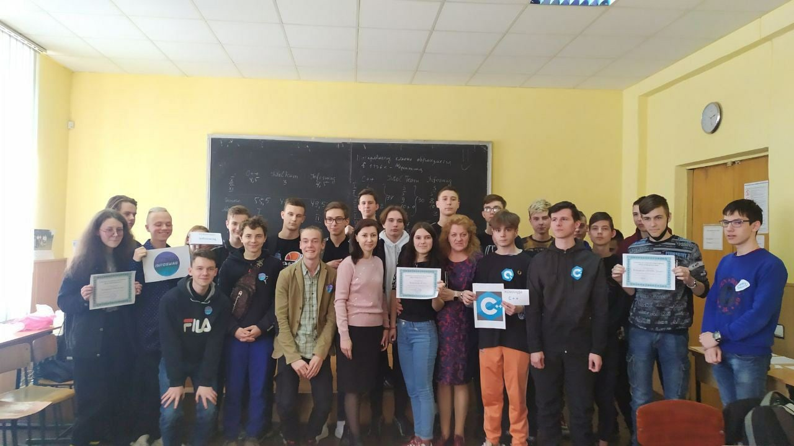
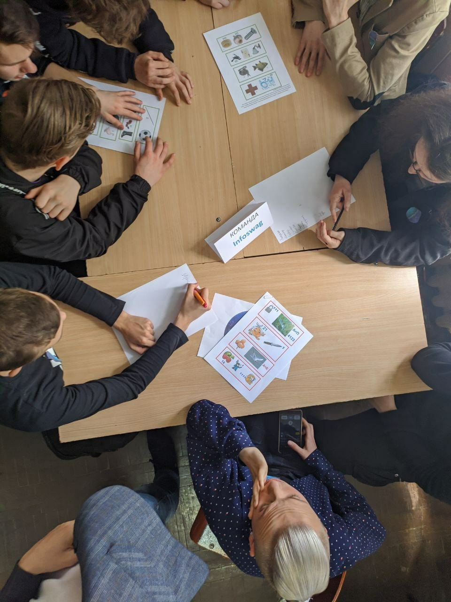
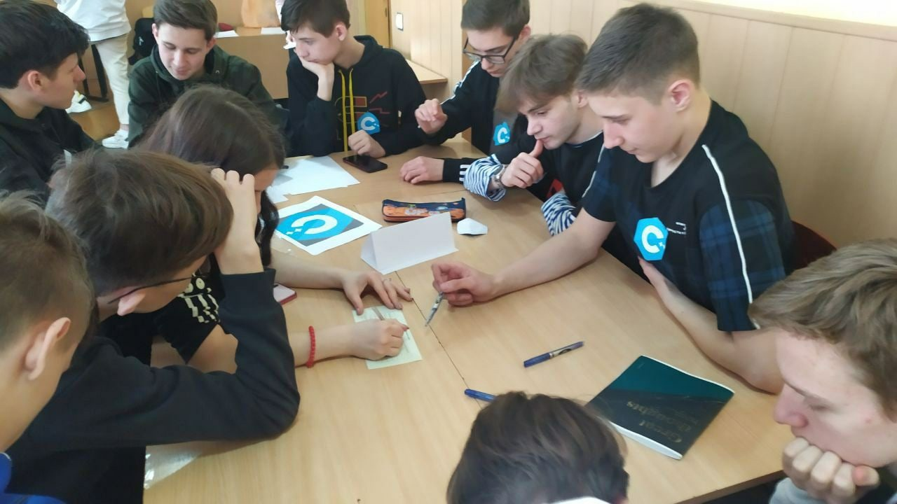
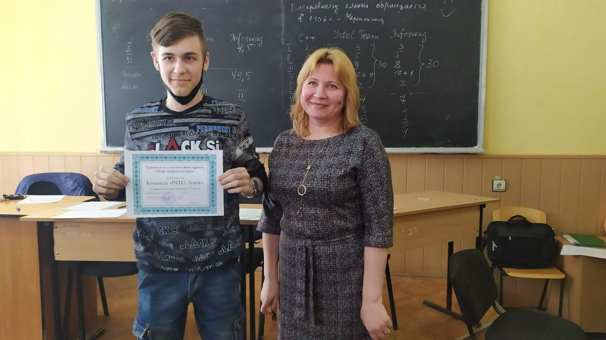
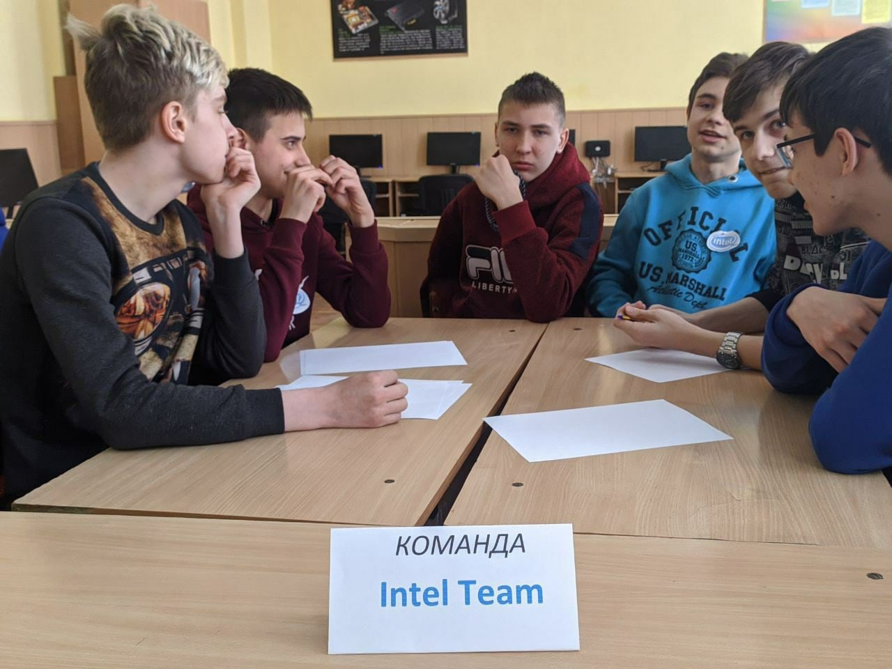

# Интеллектуально-развлекательная игра «Звёздный час информатиков»

🗓 22 апреля 2021г. в стенах ГПОУ «Донецкий политехнический колледж» в рамках Недели информатики и программирования была проведена интеллектуально-развлекательная игра «Звёздный час информатиков».

📝 В ней приняли участие студенты первого курса отделения программирования и электротехники и автоматики.

💬 Ребята разгадывали ребусы, решали задачи на логику, готовили творческие задания, проявляли свою смекалку и эрудицию.

Победу одержали команды:

- 🥇ПКС 20-1 — команда «С++»
- 🥈ПКС 20-1 — команда «infoswag»
- 🥉АП 20-1 — команда «intel team»

👥 Организаторами мероприятия выступили преподаватели спец. дисциплин - Захарчук М.В. и Мартынова Н.Н.

👥 Наше строгое жюри представляли:

- Мамедова Н.Д.,
- Величко П.И.,
- студенты старших курсов.

🎁 В конце игры все команды получили позитивные эмоции, грамоты и сладости.

