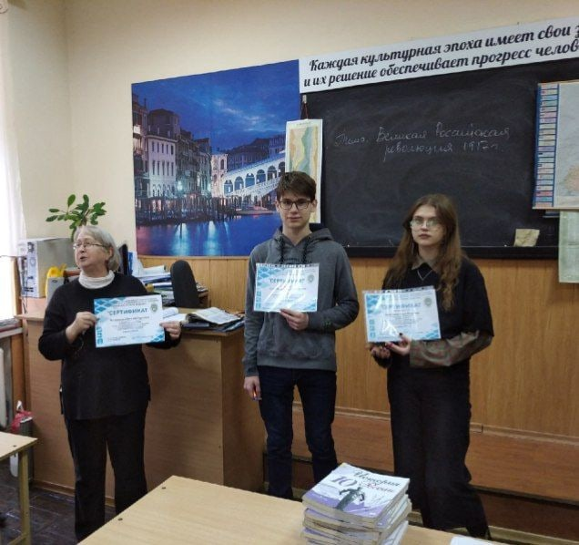
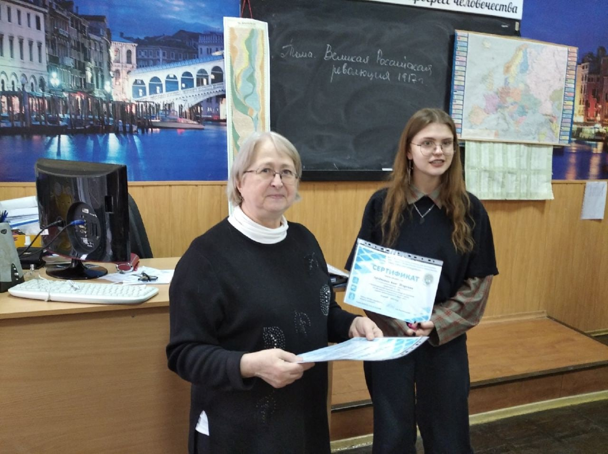
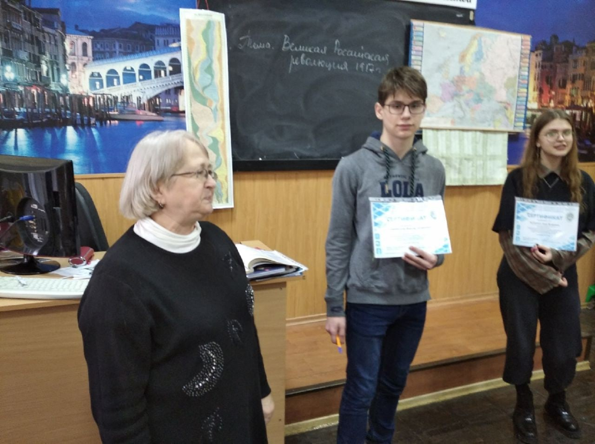

# Награждение студентов первого курса отделения программирования ПКС 20-2

Наши студенты самые талантливые 🌟

🗓 2 февраля в ГПОУ "Донецкий политехнический колледж" состоялось награждение студентов первого курса отделения программирования ПКС 20-2.

👥 Артёменко Анна и Скоробогатов Виктор получили грамоты за участие в Республиканской заочной олимпиаде по биологии для обучающихся СПО!

💬 - "Я горжусь студентами, которые участвуют в олимпиадах, и занимают активную позицию в жизни нашего колледжа" - прокомментировала Фильчакова Наталья Сергеевна - преподаватель биологии и химии ДПК.

💫Желаем всем успехов и достижений в студенческой жизни!

