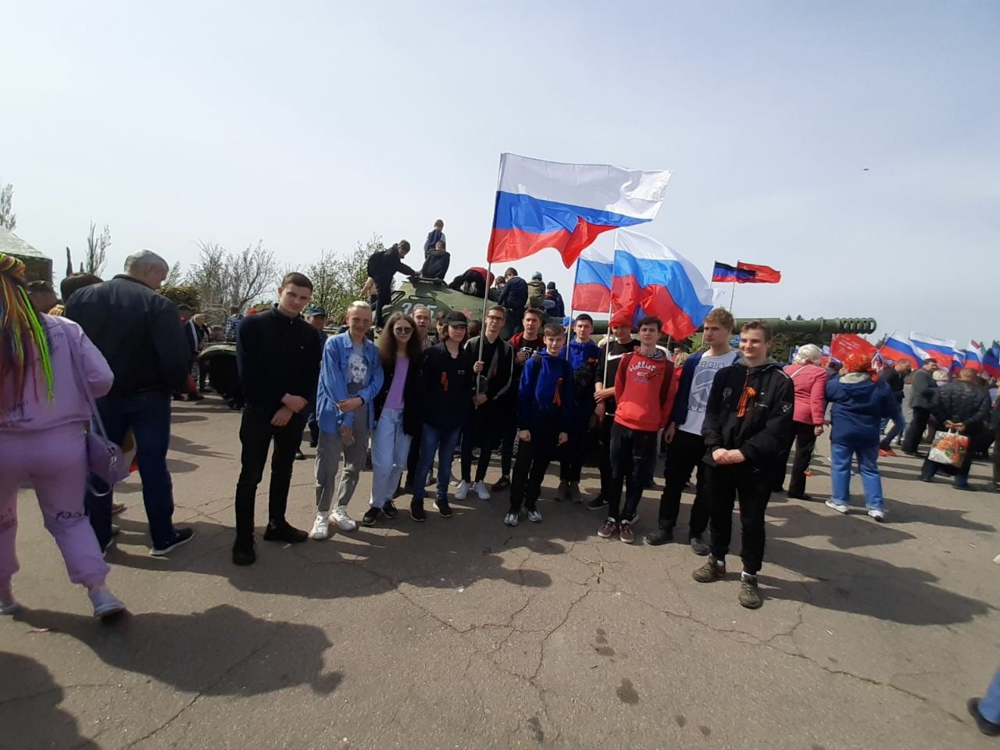
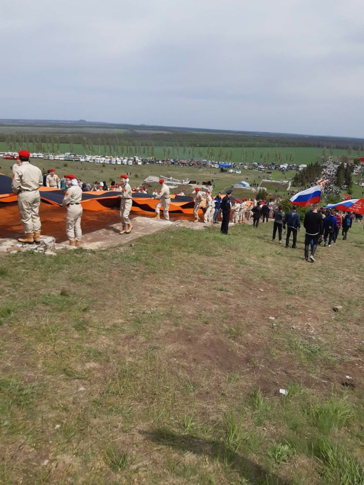
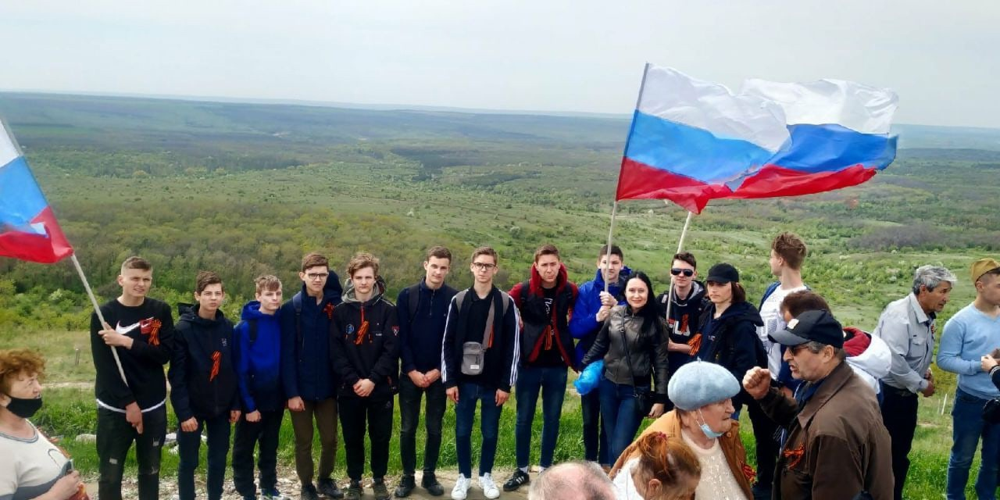

# 76 годовщина Великой Победы на мемориальном комплексе «Саур-могила»

🗓 8 мая 2021 г. студенты гр. ПКС 20-1 с кл. руководителем Ульяновой Ю.В. приняли участие в торжественном митинге, посвященном 76 годовщине Великой Победы на мемориальном комплексе «Саур-могила» Шахтёрского района.

👥 Присутствующие возложили венки и цветы к Вечному огню и могилам защитников высоты на вершине мемориального комплекса, почтили память погибших минутой молчания.

❕ В честь подвига воинов прозвучал троекратный оружейный салют роты почётного караула, развернута самая большая Георгиевская лента.

