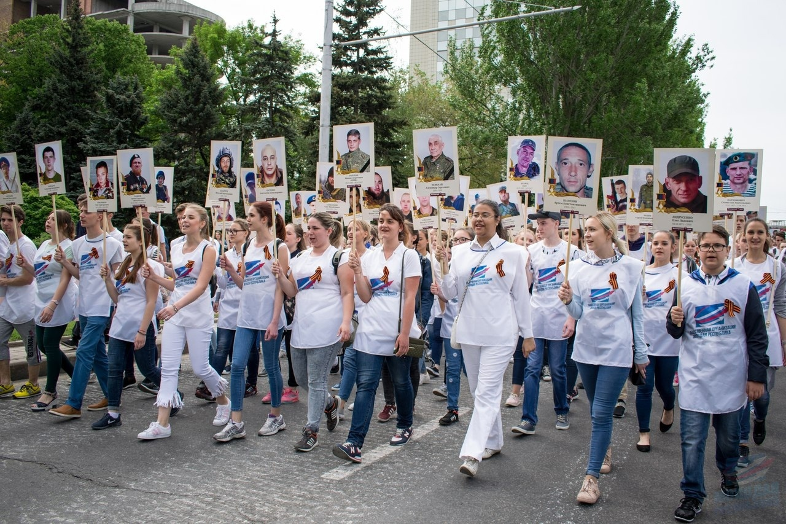
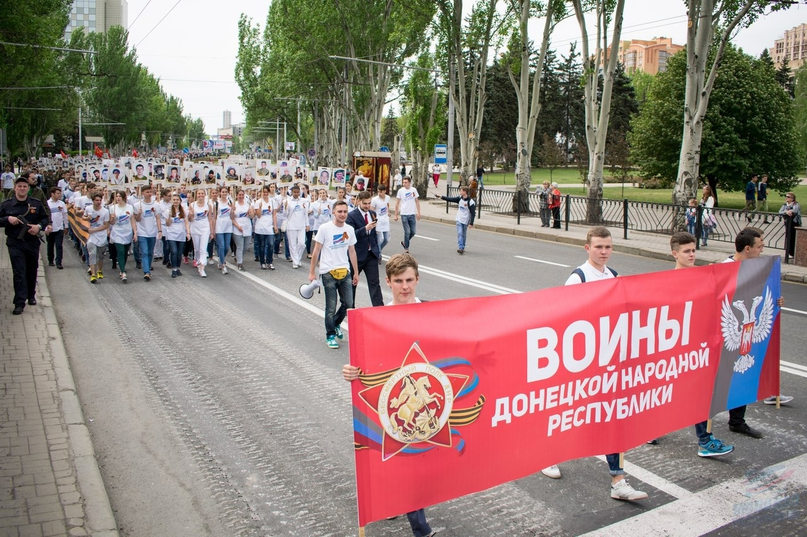

# ДПК ищет студентов для участия в акции «Бессмертный полк»

Донецкий политехнический колледж ищет студентов, которые заинтересованы помочь в организации акции «Бессмертный полк»

Волонтеры акции «Бессмертный полк» является важнейшими участниками.

Именно ВЫ:

- Помогаете нам проследить за тем, чтобы людям, которым может стать плохо, вовремя оказали медицинскую помощь;
- Являетесь главными «рамками» колонны «Бессмертного полка»;
- Оставляете свой след в таком важном шествии.

Стать волонтером может ЛЮБОЙ желающий, вне зависимости от принадлежности к «Молодой Республике»

Всенародная акция «Бессмертный полк» всколыхнула волну памяти о героях Великой Отечественной Войны, о героях Донецкой Народной Республики, которые сражались за свободу и независимость нашей Родины!

В 2018 году торжественное шествие «Бессмертного Полка» объединило свыше 116 000 людей по всей Республике и более 72 000 в столице нашей Родины – Донецке! От крупных городов до малых деревень люди выходят на шествие, чтобы сохранить народную память о том, КТО и КАКУЮ ЦЕНУ заплатил за то, чтобы сохранить жизнь потомкам и вернуть мир.

Общественная организация «Молодая Республика» призывает каждого гражданина Донецкой Народной Республики, каждого, кому дорога память о героях своей Родины, выйти 9 мая, в День Победы, с фотографией родственника-фронтовика и пройти победным строем в колонне Бессмертного Полка.

